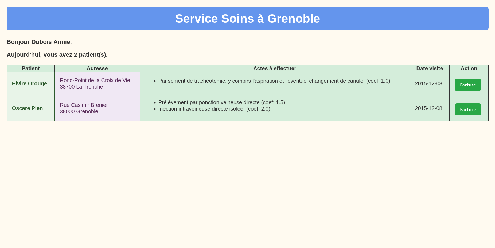
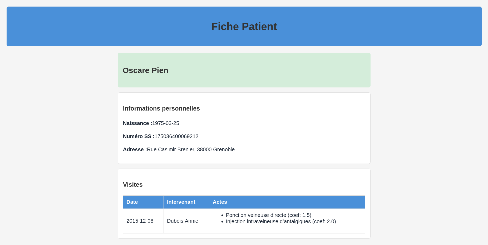
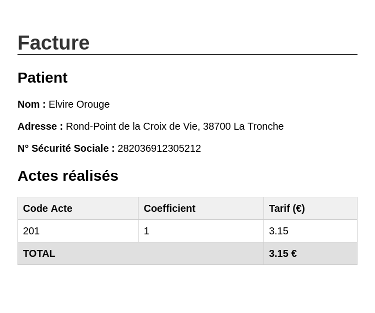

# Cabinet Infirmier

Application C# de gestion d'un cabinet infirmier utilisant XML, XSD et XSLT.

## Description

Ce projet permet de :
- **Valider** des fichiers XML avec des schémas XSD
- **Transformer** des données XML en fichiers HTML via XSLT
- **Générer** des fiches patients personnalisées

## Structure du projet

```
cabinet-infirmier/
├── Program.cs          # Point d'entrée de l'application
├── XMLUtils.cs         # Utilitaires XML (validation XSD, transformation XSLT)
├── data/
│   ├── xml/            # Fichiers de données XML
│   │   ├── cabinet.xml # Données du cabinet (patients, infirmiers, visites)
│   │   └── actes.xml   # Référentiel des actes médicaux
│   ├── xsd/            # Schémas de validation XSD
│   │   ├── cabinet.xsd # Schéma pour cabinet.xml
│   │   ├── patient.xsd # Schéma pour le XML patient généré
│   │   └── actes.xsd   # Schéma pour actes.xml
│   ├── xslt/           # Feuilles de style XSLT
│   │   ├── patient_xml.xsl  # Extraction patient → XML
│   │   ├── patient_html.xsl # XML patient → HTML
│   │   └── cabinet.xsl      # Affichage cabinet pour infirmier
│   ├── html/           # Pages HTML
│   │   ├── cabinet.html        # Page d'accueil du cabinet
│   │   ├── patient.html        # Fiche patient générée (OUTPUT)
│   │   ├── CVprogrammeurs1.html # CV programmeur 1
│   │   └── CVprogrammeurs2.html # CV programmeur 2
│   ├── css/            # Styles CSS
│   └── js/             # Scripts JavaScript
│       └── buttonScript.js     # Génération facture popup
```

## Prérequis

- .NET 8.0 ou supérieur

## Utilisation

```bash
dotnet run
```

L'application va :
1. Valider `cabinet.xml` avec le schéma `cabinet.xsd`
2. Extraire les données du patient spécifié via `patient_xml.xsl`
3. Transformer ce XML en page HTML via `patient_html.xsl`
4. Générer le fichier de sortie `data/html/patient.html`

## Fichiers de sortie (OUTPUT)

| Fichier | Description |
|---------|-------------|
| `data/html/patient.html` | Fiche HTML du patient avec ses visites et actes |
| `data/html/cabinet.html` | Page infirmier avec liste des patients et bouton facture |

## Fonctionnalités

- **Validation XSD** : Vérification de la conformité des fichiers XML
- **Facture dynamique** : Popup JavaScript affichant le détail des actes et le total

## Captures d'écran

### Page Cabinet (liste des patients pour l'infirmier)


### Fiche Patient


### Facture (popup JavaScript)


